### Hi there 👋 I'm Kaan

I'm a passionate **Software Developer** in the **Hometech R&D Department** based in **İstanbul, Türkiye**. I love building innovative tools for image processing, video automation, web development, and gaming technology enhancements. I enjoy exploring new technologies and pushing the boundaries of what's possible.

Check out my projects below – any feedback is welcome! 😉

---

### 🚀 Connect with Me

  

---

### 👨‍💻 Programming Languages and Tools

#### Web Development:
      

#### Programming Languages:
    

#### Tools & IDEs:
    

---

### 📈 My Profile Statistics

   
  
  

---

### 🔥 My Projects

  
   
   
  
  

---

### ☕ Support My Work

